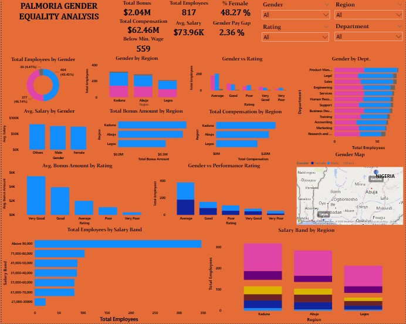

# Palmoria Gender Pay Gap HR Analytics (Power BI)

This project is a full HR analytics case study done for **Palmoria Group**, a Nigerian-based manufacturing company. The case addresses gender inequality and pay gap issues using Power BI.

---

## Project Overview

- **Company:** Palmoria Group (Manufacturing, Nigeria)
- **Challenge:** Public gender inequality criticism (“Manufacturing Patriarchy”)
- **Objective:** Use data to uncover key gender-related issues and recommend actions
- **Tool Used:** Microsoft Power BI
- **Data Source:** Digital Skill Africa (The Incubator Hub)

---

## Folder Structure
---

## Key KPIs & DAX Metrics

All important KPIs and measures are listed in:  

`Documentation/KPI_and_DAX_List.md`

---

## Dashboard Screenshots

| Visual Title                         | Preview |
|-------------------------------------|---------|
| Gender Overview                     |  |
| Gender by Region                    |  |
| Gender by Department                |  |
| Gender by Performance Rating        |  |
| Gender by Rating                    |  |
| Gender Map                          |  |
| % Female Card                       |  |
| Total Employees                     |  |
| Average Salary Card                 |  |
| Avg Salary by Gender                |  |
| Gender Pay Gap Card                 |  |
| Below Minimum Wage Card             |  |
| Total Bonus Card                    |  |
| Total Bonus Amount by Region        |  |
| Total Compensation Card             |  |
| Total Compensation by Region        |  |
| Total Employees by Salary Band      |  |
| Dashboard Overview                  |  |

---

## Conclusion

The analysis uncovered key gender-related disparities and provided actionable insights for management. Using Power BI, Palmoria Group can track progress, make HR decisions with transparency, and comply with local salary regulations.

---

## Data Source

This project was completed using data provided by:  
**Digital Skill Africa (The Incubator Hub)**
